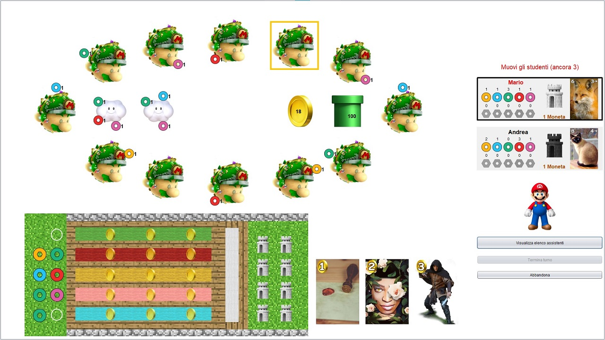

# Eriantys

Trasposizione del gioco da tavolo Eriantys by Cranio Creations

Progetto di Prova Finale di Ingegneria del Software, 3° Anno Laurea Triennale @ Politecnico di Milano<br>
Creato in collaborazione con altri 2 studenti del corso<br>
⚠Gli assets non sono gli originali in quanto protetti da copyright⚠



## How to use
* Server: ```java -jar Eriantys.jar --server [--port server_port]``` (default port: 5000)

* CLI: ```java -jar Eriantys.jar --client --cli```

* GUI: ```java -jar Eriantys.jar [--client [--gui]]```

## Functionalities

| Functionality | State |
|---------------|:-----:|
|Basic Rules|🟢|
|Complete Rules|🟢|
|Socket|🟢|
|CLI|🟢|
|GUI|🟢|

|Advanced Functionalities|State|
|------------------------|:---:|
|Character cards|🟢|
|4 Players|🟢|
|Multiple matches|🟢|
|Persistance|❌|
|Disconnections Resilience|-|

| Legend |                  |
|:------:|------------------|
|   🔴   | Not yet started  |
|   🚧   | Work in progress |
|   🟢   | Finished         |
|   ❌    | Canceled         |

## Coverage

Number of tests: 284

#### it.polimi.ingsw
|package/class|Class|Method|Line|
|------------------------|---|----|----|
|clients.\*|0% (0/44)|0% (0/379)|0% (0/2516)|
|models.\*|100% (55/55)|95% (364/383)|90% (1199/1321)|
|network.\*|40% (4/10)|43% (19/44)|66% (87/131)|
|server.\*|28% (2/7)|30% (23/75)|30% (105/340)|
|Eriantys.java|0% (0/1)|0% (0/5)|0% (0/17)|

#### it.polimi.ingsw.models
|package/class|Class|Method|Line|
|------------------------|---|----|----|
|components.\*|100% (34/34)|93% (178/190)|91% (480/523)|
|constants.\*|100% (3/3)|100% (14/14)|96% (28/29)|
|exceptions.\*|100% (6/6)|100% (6/6)|100% (6/6)|
|operations.\*|100% (6/6)|94% (66/70)|95% (431/452)|
|state.\*|100% (3/3)|98% (73/74)|95% (131/137)|
|utils.\*|100% (1/1)|100% (1/1)|100% (1/1)|
|GameManager.java|100% (2/2)|92% (26/28)|70% (122/173)|

#### it.polimi.ingsw.network
|package/class|Class|Method|Line|
|------------------------|---|----|----|
|messages.\*|100% (1/1)|100% (5/5)|96% (28/29)|
|observers.\*|16% (1/6)|12% (3/24)|8% (3/36)|
|GsonManager.java|100% (1/1)|100% (1/1)|100% (3/3)|
|JsonCommand.java|100% (1/1)|100% (10/10)|100% (53/53)|
|SocketStreamUtils.java|0% (0/1)|0% (0/4)|0% (0/10)|

#### it.polimi.ingsw.server
|package/class|Class|Method|Line|
|------------------------|---|----|----|
|modules.\*|0% (0/4)|0% (0/36)|0% (0/135)|
|Server.java|0% (0/1)|0% (0/13)|0% (0/86)|
|ServerController.java|100% (2/2)|88% (23/26)|88% (105/119)|
